# Loop-Suite

**Independent lens review → anonymized cross-verification (discourse) → deterministic verdict.** One execution pattern, ported across domains as a family of Rust CLIs.

Each tool has multiple expert personas review content independently, cross-check each other's judgments anonymously (no author identity, to avoid authority bias), and then compute the score and pass/fail outcome with local deterministic logic — not the LLM. The *aggregation arithmetic* (severity weights, confidence thresholds, PASS/BLOCK cutoffs) is always plain code, not an LLM call. But its inputs — finding severity, discourse resolution, citation/verification status — are themselves LLM-produced judgments, not independently re-verified facts. Treat "deterministic verdict" as "deterministic arithmetic over model judgments," not as external validation.

## Why this pattern

A single LLM call reviewing its own (or someone else's) work has three well-known failure modes: it doesn't know what it doesn't know, it tends to agree with whatever framing the prompt implies, and its confidence doesn't track its actual accuracy. Multiplying calls doesn't fix this by itself — three correlated calls to the same model are still one opinion asked three times.

Loop-Suite's answer, applied consistently across every tool in this org:

- **Split judgment from arithmetic.** An LLM decides *what's true* (a finding, a ranking, a category). Plain Rust code decides *what that adds up to* (a score, a PASS/FAIL, a verdict). If a bug is in the scoring, it's a reproducible code bug, not a re-roll-and-hope prompt problem.
- **Force independence before consensus.** Reviewers don't see each other's names or, in most tools, each other's opinions before rendering their own verdict. Agreement has to survive being computed from anonymous, uncorrelated inputs — not from social pressure to converge with whoever answered first.
- **Never trust a verdict you can't regenerate.** Every tool's state (`state.json`) captures enough to re-run deterministic checks without another LLM call (`validate`-style commands) and to feed prior findings back into a new round (`--prior` / `refine`) instead of starting blind every time.

The specifics — how many personas, whether discourse is sequential debate or independent blind voting, what counts as a valid challenge — differ by domain. See [Pipelines](#pipelines) below for what each tool actually does, not just the abstract shape.

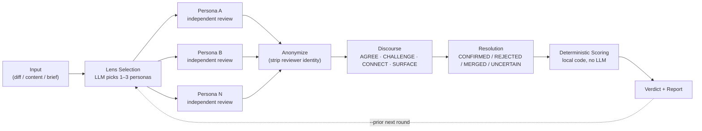

## Getting started

Every tool is an independent Rust binary — clone the one you need, there's no shared crate or monorepo build:

```bash
git clone https://github.com/Loop-Suite/<name>.git
cd <name>
cargo build --release
```

All of them default to the `claude` CLI as the LLM backend (a subprocess call, `claude -p --output-format json` — no separate API key needed if you already use Claude Code), with an OpenRouter backend as an alternative or, in `icon-loop`'s case, as a second panel member for judge diversity. Each repo's own `README.md` has the actual subcommands and a real example invocation — start there.

## Projects

| Repo | Domain | Notes |
|---|---|---|
| **[Code-Review-Loop](https://github.com/Loop-Suite/Code-Review-Loop)** | PR diff code review | public. The original Rust CLI — where this pattern started. Also bundles a reproducible benchmark for the related `full-review` Claude Code skill under [`harness/`](https://github.com/Loop-Suite/Code-Review-Loop/tree/main/harness) (Node-based, separate from the discourse pipeline). |
| **[marketing-loop](https://github.com/Loop-Suite/marketing-loop)** | Marketing content review (ad copy, landing pages, email) | public. Design stage only so far (not yet implemented) — research survey + pipeline spec ported from Code-Review-Loop. |
| **[bizplan-loop](https://github.com/Loop-Suite/bizplan-loop)** | Business plan generation (N drafts → rubric scoring → regenerate) | public, a variant without discourse |
| **[aso-loop](https://github.com/Loop-Suite/aso-loop)** | App Store Optimization listing copy (title/subtitle/keywords/description) | public, bizplan-loop variant (no discourse). Keyword normalization/dedup logic ported from semihcihan/App-Store-Optimization-CLI (MIT). |
| **[geo-loop](https://github.com/Loop-Suite/geo-loop)** | Generative Engine Optimization content (citability for ChatGPT/Perplexity/Google AI Overviews) | public, bizplan-loop variant (no discourse). llms.txt validation ported from Auriti-Labs/geo-optimizer-skill (MIT); JSON-LD scaffolding from ai-search-guru/getcito (MIT); FAQPage/Article required-field checks implemented from Google Search Central's structured-data guidelines (not a code port). |
| **[seo-loop](https://github.com/Loop-Suite/seo-loop)** | SEO content copy (title/meta/heading structure/E-E-A-T signals) | public, bizplan-loop variant (no discourse). Complementary to the (non-Loop-Suite) `seo-reference-library` skill — that one audits existing sites, this one generates and scores new copy. Flesch readability logic ported from IamRamgarhia/BlogPilot (MIT); paragraph-length check idea from CyberCraftBD/power-seo (MIT). |
| **[research-loop](https://github.com/Loop-Suite/research-loop)** | Market/competitor research document validation | public. Motivated by a real multi-round POS-competitor research doc; catches quantitative-vs-qualitative disagreement, a subject's own marketing dominating its citations, incentivized reviews, numeric drift across drafts, and prior conclusions overturned by newer evidence (`REVERSED` status). Source-level re-verification of GPT Researcher/company-research-agent/MetaGPT is in its evidence survey. |
| **[secretscan-loop](https://github.com/Loop-Suite/secretscan-loop)** | Pre-push/pre-publish secret-scanner-finding triage | public, **known issue**: masking is per-match, not per-line — a second secret sharing a line with the first candidate can still reach the LLM context ([issue](https://github.com/Loop-Suite/secretscan-loop/issues/4)). Domain already has mature deterministic scanners (gitleaks/trufflehog) — the discourse layer triages *their* output, but currently LLM discourse can also downgrade a scanner-verified secret to PASS ([issue](https://github.com/Loop-Suite/secretscan-loop/issues/3)). Do not point this at a repo with real live secrets until those are fixed. |
| **[icon-loop](https://github.com/Loop-Suite/icon-loop)** | App icon (vector) design | public. Discourse variant — critics are fully independent and blind (no sequential AGREE/CHALLENGE exposure), aggregated with a deterministic Borda count instead; also flags unanimous agreement (possible collusion) and surfaces minority opinions a naive aggregate would bury. Critic backends can mix claude/openrouter so the panel isn't just the same model called N times. Rendering is pure Rust (resvg/usvg/tiny-skia, no external binary), and policy.rs checks canvas containment/palette/small-size legibility against the actual rendered pixels, not the raw SVG source. |

## Pipelines

The shared diagram above is the abstract shape. Each project bends it differently — module names, persona pools, and what counts as a valid `CHALLENGE` are all domain-specific. One diagram per repo, grounded in its actual source:

### Code-Review-Loop

The original. 12-step pipeline, PR diff in, review report out.

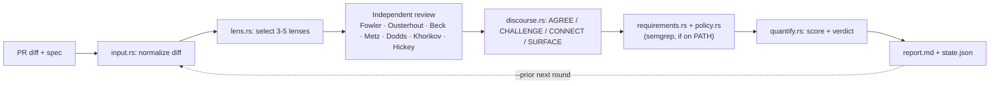

### codedesign-loop

Same shape, one stage earlier — reviews a design/architecture brief before any code exists.

```mermaid
flowchart LR
    A["brief + repo-context + constraints"] --> B["discover.rs: problem, users, non-goals"]
    B --> C["requirements.rs: REQ ids + acceptance criteria"]
    C --> D["lens.rs: independent design lenses"]
    D --> E["discourse.rs: anonymized cross-check"]
    E --> F["contract.rs: components, interfaces, ADRs"]
    F --> G["tasks.rs: traceable task breakdown"]
    G --> H["policy.rs: deterministic quality gates"]
    H --> I["quantify.rs: score + verdict"]
    I --> J["design.md / tasks.md / report.md / state.json"]
    J -.->|"refine with feedback"| B
```

### marketing-loop

Design stage only so far (not yet implemented) — content review with a 7-persona pool, 3-5 selected per content type.

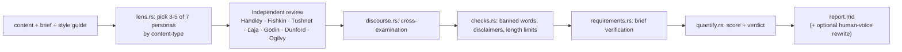

### bizplan-loop

The one variant with no discourse — generate N drafts, score, keep the best, optionally loop.

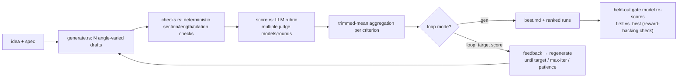

### aso-loop

Same no-discourse shape as bizplan-loop, ported to app-store listing copy.

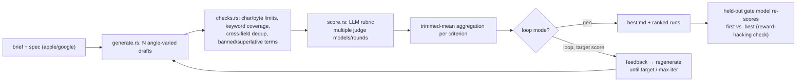

### geo-loop

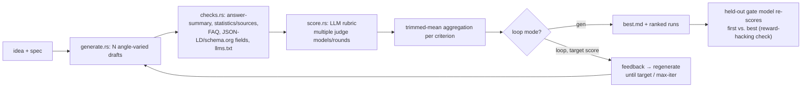

### seo-loop

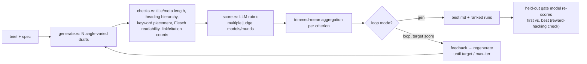

### research-loop

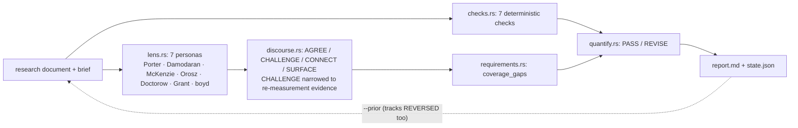

### secretscan-loop

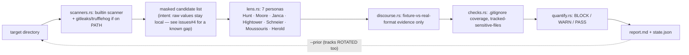

### icon-loop

The one variant where discourse is fully independent instead of sequential — critics never see each other's rulings, so the AGREE/CHALLENGE debate step is replaced by parallel blind calls plus deterministic vote aggregation. In practice: a persona was confident its own triangle-with-eye design wouldn't be misread, and every independent critic read it as a mountain/spark shape anyway — the kind of mismatch deterministic geometry checks can't see, and that sequential discourse (where the first opinion can anchor the rest) is more likely to paper over than catch.

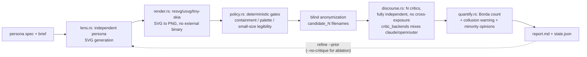

### Code-Review-Loop → `harness/` (the benchmark — different shape entirely)

Not the Rust pipeline above. A Node.js harness, bundled under `harness/` in the same repo, that benchmarks the separate `full-review` Claude Code skill against known-mutation fixtures.

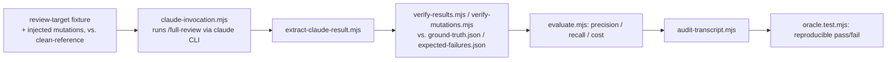

## Shared principles

- **Rust CLI**, defaulting to the Claude Code CLI (`claude -p --output-format json`) as a subprocess backend — no separate API key required. An OpenRouter backend is also supported.
- **Deterministic logic and LLM judgment are split at the code level.** Scoring, policy checks, and verdicts are computed locally and deterministically; the LLM only handles judgment-dependent steps like lens selection, review, discourse, and requirement verification.
- **Anonymized cross-verification**: reviewer identity is stripped before discourse, so agreement/disagreement is forced to run on claims and evidence rather than persona authority.
- Re-running with `--prior` tracks FIXED / STILL_OPEN / UNKNOWN against the previous round (except bizplan-loop and its aso-loop/geo-loop/seo-loop siblings, which are generate-and-score rather than review-based). Domain-specific extensions add extra states where FIXED/STILL_OPEN/UNKNOWN don't cover the failure mode: research-loop adds `REVERSED` (a prior conclusion overturned by newer evidence, not just updated), secretscan-loop adds `ROTATED` (the string is still physically present but the credential itself was rotated/revoked).
- Where a project reuses logic from outside Loop-Suite (e.g. aso-loop/geo-loop/seo-loop porting small algorithms from MIT-licensed tools, or citing public guidelines like Google Search Central's structured-data docs), the source is cited in that repo's `NOTICE`/`README.md` — never copied from code without a compatible license.

## What "deterministic verdict" doesn't mean

Worth repeating from the top, because it's the most common misread of this pattern: the score/verdict math being deterministic code doesn't make the *verdict itself* independently verified fact. The inputs to that math — a finding's severity, whether a CHALLENGE was resolved, whether a citation checks out — are still LLM judgments. Determinism buys you *reproducibility* (the same findings always score the same way) and *auditability* (you can read the scoring code and know exactly why a verdict landed where it did) — not ground truth. Read a `report.md`'s findings as claims to spot-check, not as settled facts.

## License

Every repo listed above is Apache-2.0 — see each repo's own `LICENSE`.

---

[Code-Review-Loop](https://github.com/Loop-Suite/Code-Review-Loop), [marketing-loop](https://github.com/Loop-Suite/marketing-loop), [bizplan-loop](https://github.com/Loop-Suite/bizplan-loop), [aso-loop](https://github.com/Loop-Suite/aso-loop), [geo-loop](https://github.com/Loop-Suite/geo-loop), [seo-loop](https://github.com/Loop-Suite/seo-loop), [research-loop](https://github.com/Loop-Suite/research-loop), [secretscan-loop](https://github.com/Loop-Suite/secretscan-loop), and [icon-loop](https://github.com/Loop-Suite/icon-loop) are public today. One more (pre-code design/architecture review domain) stays private for now.
